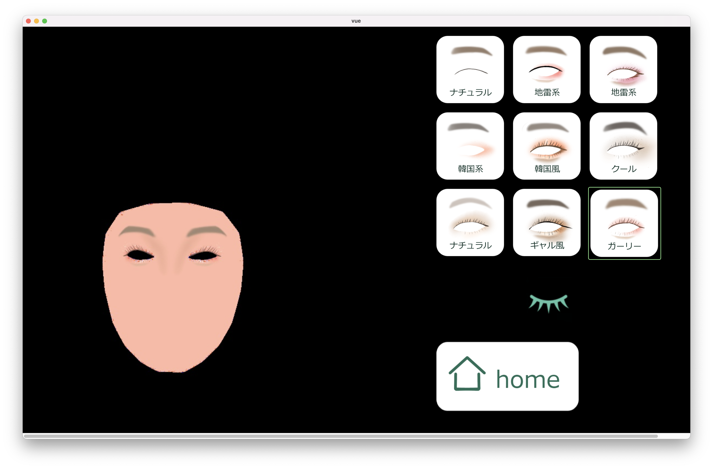

# iMake! －３次元仮想メイクで全人類の化粧技術向上－

第33回全国高専プログラミングコンテスト【自由部門】に向けて開発しているプロジェクトです。

## Overview

iMake!は、プロジェクターを用いた、どんな人でもメイクを気軽に楽しめる仮想メイクシステムです。 iMake!では、プロジェクターから顔に映し出された画像を、鏡を通して見ることで、より理想的なメイクを体感できます。



## Requirement

### OS

- macOS
- Linux

windowsでの動作は未確認です。

### Library

- npm
- python 3.10.5
- poetry

## Getting Started

### Prerequisites

#### Poetry

Pythonファイルの依存関係管理はpoetryを使用します。

1. <https://python-poetry.org/docs/#installation>
1. `python -m venv venv`
1. `source venv/bin/activate`
1. `pip install --upgrade pip` (必要であれば)
1. `poetry install`

#### pre-commit (for developers)

commitする前に実行するコマンドを定義するツールです。`.pre-commit-config.yaml` に定義済みなので、それを各自の環境に設定する必要があります。下記手順で行ってください。

1. <https://pre-commit.com/#installation>
1. `pre-commit install`

### Installation

1. Clone the repository

    ```bash
    git clone https://github.com/kathmandu777/i-make
    ```

1. Install npm packages

    ```bash
    cd imake/vue
    npm install
    ```

1. Build vue project

    ```bash
    npm run build
    ```

1. Install python packages

    ```bash
    cd ../..
    poetry install
    ```

    poetryのsetupは[こちら](#poetry)を参照してください。

## Usage

Run the system

```bash
python -m imake
```

(For developers) Run the system after building vue project

```bash
./build.sh
```

## Docs

- [技術構成](docs/TECK_STACK.md)

## Author

- [Manato Kato](https://github.com/kathmandu777)

## License

Distributed under the [MIT](https://github.com/kathmandu777/i-make/blob/main/LICENSE) License. See `LICENSE` for more information.

## Acknowledgements

- [luxonis](https://github.com/luxonis/depthai-experiments/tree/master/gen2-facemesh)
- [Eel](https://github.com/python-eel/Eel)
- [MediaPipe Face Mesh](https://google.github.io/mediapipe/solutions/face_mesh.html)
