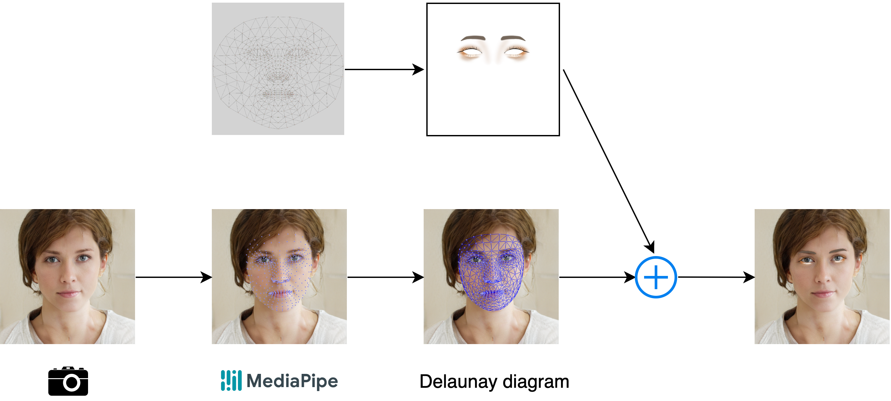

# 技術構成

画像処理やシステム制御などの主要処理はPythonによって行われています。UIはVue.jsによって実装されています。Vue.jsとpythonの連携はEelを用いています。

## Python (imake/)

### メイク画像処理



カメラに寄ってキャプチャした画像を、mediapipeのfacemeshに渡して、顔のランドマークを取得します。その後、ランドマークを元にドロネーの三角形を用いてメイクの位置を計算し、メイク画像を合成します。

### システム制御

```markdown
- ファイルパス [クラス名]
  - 説明
```

- \_\_main\_\_.py [Imake]
  - Eelと内部のクラスとのインターフェースを担当
- libs/effect.py [Effect]
  - メイク画像(effect_image)を、与えられた顔座標(landmarks)に合成する
- mode/base.py [BaseMode]
  - 全てのモードの基底クラス
- mode/base.py [BaseModeEffect]
  - BaseModeとEffectクラスを継承した画像処理を伴うモードの基底クラス
- mode/* [*]
  - 各モードのクラス

## Vue.js (imake/vue/)

UI実装
